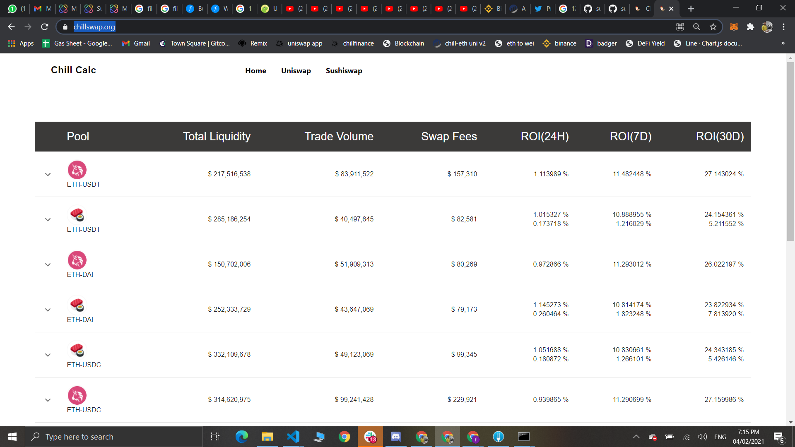

# Gitcoin GR9 Hack(The Graph)

## Defi-Historical-Portfolio

It measures the Historical performance of the defi protocols.
Currently supported protocols is uniswap and sushiswap.
Protocol used `theGraph` protocol to extract the historical performance and make the calculation to measures the historical data of any lp pairs of any platform like sushiswap, uniswap.

### Idea
Idea is to build a platform which provides a historical performance of the crypto pair
like, ROI, asset change and impermennet loss 

If user wants to know that if he/she invested 10000$ in 1inch/uniswap/sushiswap before 3 or some months back, then what will be the ROI, IL and asset changes of underlying asset in that pair...like it will calculate historical info to user so user can analyze past performenace of particular crypto pair or particular defi platform.

even we can give info about best pair and best platform to invest for now...from the past historical data
also will provide some visulaization in graph and chart
so, some user wants to invest but before invest they wants to know the platform and pair performance so they can check

one usecase is also like:

User comes to platform and check on platform 
and like, 4 months back if i invested 10000$
now what will be my portfolio?

To extract data we used the graph protocol.

### Screenshots

#### 1. 

#### 2. 

#### 3. 

#### 4. 

#### 5. 

#### 6. 

### Install and Run

1). Clone repo
2). yarn
3). yarn start
4). That's it!

